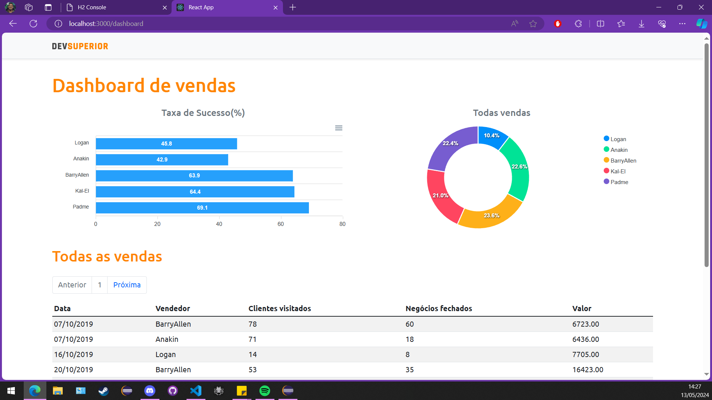

# SDS5 - Sistema de Análise de Vendas

O SDS5 é um programa desenvolvido em React e Spring Boot para análise de vendas. Ele fornece endpoints de API para acessar informações sobre vendedores e vendas, além de calcular estatísticas sobre as vendas realizadas.

## Tecnologias Utilizadas

- **Frontend:** React (Typescript)
- **Backend:** Spring Boot (Java)
- **Gerenciador de Pacotes:** Yarn (Frontend), Maven (Backend)

## Estrutura do Projeto

O projeto está dividido em duas partes principais:

- **frontend:** Contém o código fonte do frontend desenvolvido em React com Typescript. Este diretório é gerenciado com Yarn.
- **backend:** Contém o código fonte do backend desenvolvido em Spring Boot com Java. Este diretório é gerenciado com Maven.

## Endpoints da API

- **GET /sellers:** Retorna a lista de todos os vendedores.
- **GET /sales:** Retorna a lista de todas as vendas.
- **GET /sales/sum:** Retorna a soma total das vendas agrupadas por vendedor.
- **GET /sales/success:** Retorna a contagem de vendas bem-sucedidas agrupadas por vendedor.

## Configuração do Ambiente de Desenvolvimento

1. **Clonar o Repositório:**

- `git clone https://github.com/seu-usuario/sds5.git`

2. **Configurar o Backend:**
- Importe o projeto maven da pasta `backend` com o [SpringTools](https://spring.io/tools).
- Execute o `pom.xml` como `maven install` para instalar as dependências do projeto.
- Execute o programa principal.

3. **Configurar o Frontend:**
- Navegue até o diretório `frontend` do projeto.
- Execute o comando `yarn install` para instalar as dependências do React.
- Execute o comando `yarn start` para iniciar o servidor de desenvolvimento do React.
- Endereço local da api disponível em `./src/utils/request.ts`

4. **Acessar o Aplicativo:**
- O aplicativo estará disponível em `http://localhost:3000` por padrão.

## Contribuição

Contribuições são bem-vindas! Sinta-se à vontade para abrir uma issue ou enviar um pull request.

## Licença

Este projeto é licenciado sob a Licença [MIT](https://opensource.org/licenses/MIT).
